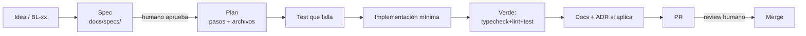

# Flujo de trabajo AI-first

Cómo se desarrolla este proyecto con agentes de IA como ejecutores principales
y humanos como dueños de las decisiones.

## Roles

| Quién | Hace | Decide |
| --- | --- | --- |
| Humano | Define el problema, aprueba specs y PRs | Alcance, prioridades, trade-offs |
| Agente | Redacta specs, planifica, escribe tests y código, verifica | Detalles de implementación dentro de la spec |

## Ciclo (spec-driven)

1. **Spec** — desde `docs/specs/_template.md` o `/nuevo-spec`. Criterios de aceptación con ID, verificables.
2. **Aprobación** — el humano revisa objetivo, fuera de alcance y ACs. Sin aprobación no se implementa.
3. **Plan** — lista de pasos con archivos concretos; cada paso deja el repo verde.
4. **TDD** — un test por AC antes del código.
5. **Verificación** — `npm run typecheck && npm run lint && npm test`; para cambios visuales, `npm run dev` y revisar `/` y `/hud`.
6. **Documentación** — actualizar spec (estado → implementado), `data-contract.md` si cambió el contrato, ADR si hubo decisión.

Tareas triviales (typo, estilo, un token) pueden saltarse la spec, no la verificación.

## Definición de hecho (DoD)

- [ ] Todos los ACs de la spec tienen test y pasan
- [ ] `typecheck`, `lint` y `test` verdes (salida pegada en el PR)
- [ ] Sin colores hex ni fetch en componentes (invariantes de `CLAUDE.md`)
- [ ] Estados `connecting/live/error` contemplados
- [ ] reduced-motion y teclado revisados si hay UI nueva
- [ ] Spec, contrato y ADR actualizados
- [ ] Sin dependencias nuevas no justificadas

## Cómo pedirle trabajo a un agente

Buen prompt = referencia a spec + restricción + verificación:

> Implementa `BL-01` según `docs/specs/backlog.md` y `data-contract.md` §1.
> Solo toca `jharvisSource.ts` y su test. Termina con typecheck, lint y test verdes.

Evita: "mejora el HUD", "arregla el backend" (sin spec ni criterio de hecho).

## Comandos del proyecto (Claude Code)

| Comando | Qué hace |
| --- | --- |
| `/nuevo-spec <idea o BL-xx>` | Redacta una spec desde la plantilla y la deja en `docs/specs/` para aprobación |
| `/implementar-spec <ruta>` | Plan → TDD → implementación → verificación de una spec aprobada |

Definidos en `.claude/commands/`.

## Memoria y contexto

Tres capas, cada una con un dueño claro:

| Capa | Qué guarda | Fuente de verdad |
| --- | --- | --- |
| Repo (`CLAUDE.md`, `docs/`) | Invariantes, specs, contrato, ADRs, backlog | **Sí** — manda sobre todo lo demás |
| Engram (memoria persistente del agente) | Contexto entre sesiones: descubrimientos, gotchas, estado del trabajo en curso, preferencias del equipo | No — es un índice de trabajo; si contradice al repo, gana el repo |
| Conversación | Lo efímero de la tarea actual | No |

### Engram en este proyecto

Proyecto engram: `dev-stud` (se detecta desde el directorio). Cualquier agente con
el MCP `engram` debe:

1. **Al empezar** una tarea: `mem_context` y `mem_search` con las palabras clave
   de la tarea (`BL-01`, `jharvisSource`, `reactor-hud`…) para recuperar trabajo previo.
2. **Durante** la tarea: `mem_save` en cuanto haya una decisión, un bug
   resuelto (con causa raíz), un gotcha o una preferencia del humano. No esperar al final.
3. **Al terminar**: `mem_session_summary` (objetivo, descubrimientos, hecho, siguiente paso, archivos).

Convenciones de `topic_key` (para que las observaciones se actualicen en vez de duplicarse):

| `topic_key` | Contenido |
| --- | --- |
| `jharvis-os/architecture` | Resumen de capas e invariantes (espejo de `CLAUDE.md`) |
| `jharvis-os/data-contract` | Estado del contrato con el backend y sus brechas |
| `jharvis-os/backlog` | Estado de BL-xx (pendiente / en curso / hecho) |
| `jharvis-os/spec/<id>` | Progreso y decisiones de una spec concreta |
| `jharvis-os/env` | Gotchas de entorno (nvm, variables `VITE_*`) |
| `jharvis-os/workflow` | Cómo quiere trabajar el equipo con agentes |

Reglas:

- Lo que deba sobrevivir al agente (decisión de arquitectura, cambio de contrato)
  va **primero al repo** (ADR/spec) y luego se referencia en engram con la ruta.
- Nada de secretos, tokens ni `.env.local` en engram.
- Al cerrar un BL-xx, actualizar `jharvis-os/backlog` y la tabla de `backlog.md`.
